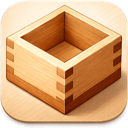

<p align="center">
  
</p>

# Mas - macOS スクリーンショットアプリ

> まるでマスですくうように簡単に正確にスクリーンショットを作成します


[](https://github.com/piggest/Mas/releases/latest)

## 概要

Mas（Mac Area Screenshot）は、macOS向けのネイティブスクリーンショットアプリケーションです。メニューバーに常駐し、グローバルホットキーで素早くスクリーンショットを撮影できます。撮影後は編集ウィンドウが自動的に表示され、矢印やテキストなどの注釈を追加できます。GIF録画やテキスト認識（OCR）にも対応しています。

## 特徴

- **メニューバー常駐**: Dockに表示されず、メニューバーから操作
- **グローバルホットキー**: 他のアプリを使用中でも素早くキャプチャ（カスタマイズ可能）
- **多彩なキャプチャ**: 全画面、範囲選択、ウィンドウ、キャプチャ枠
- **GIF録画**: 画面領域をアニメーションGIFとして録画
- **豊富な編集ツール**: ペン、マーカー、矢印、四角、丸、テキスト、モザイク、トリミング
- **テキスト認識（OCR）**: スクリーンショット内のテキストを文字単位で選択・コピー
- **ライブラリ**: キャプチャ履歴をサムネイル付きで管理
- **自動保存**: クリップボードへのコピーとファイル保存を自動実行
- **自動更新**: GitHub Releasesから最新版を自動検出・更新
- **Retina対応**: 高解像度ディスプレイに完全対応

## システム要件

- macOS 13.0（Ventura）以上
- 画面収録の権限（初回起動時に許可が必要）

## ダウンロード

[最新版をダウンロード](https://github.com/piggest/Mas/releases/latest)

1. `Mas-x.x.x.dmg`をダウンロード
2. DMGを開いて`Mas.app`を`Applications`フォルダにドラッグ&ドロップ
3. 初回起動時に「開発元が未確認」の警告が出た場合は、システム設定 → プライバシーとセキュリティ → 「このまま開く」をクリック
4. 画面収録の権限を許可

## 使い方

### キャプチャモード

| モード | ショートカット | 説明 |
|--------|---------------|------|
| 全画面 | `⌘⇧3` | メインディスプレイ全体をキャプチャ |
| 範囲選択 | `⌘⇧4` | マウスドラッグで選択した範囲をキャプチャ |
| ウィンドウ | `⌘⇧5` | 特定のウィンドウをキャプチャ |
| キャプチャ枠表示 | `⌘⇧6` | 前回の範囲でキャプチャ枠を表示 |
| GIF録画 | `⌘⇧7` | 画面領域をGIF形式で録画 |
| ライブラリ | `⌘⇧L` | スクリーンショット履歴を表示 |

ショートカットキーは設定画面からカスタマイズできます。

### メニューバーアイコン

- **シングルクリック**: メニューを表示
- **ダブルクリック**: 範囲選択キャプチャを開始

### 範囲選択モード

1. `⌘⇧4`を押すと画面全体にオーバーレイが表示されます
2. マウスをドラッグして範囲を選択
3. マウスを離すとキャプチャが実行されます
4. `ESC`キーでキャンセル

### GIF録画

1. `⌘⇧7`を押すと範囲選択モードに入ります
2. ドラッグで録画範囲を選択すると録画が開始されます
3. 録画範囲の上部にコントロールパネルが表示されます
4. 停止ボタンを押すとGIFファイルが生成されます

録画コントロールウィンドウはGIFに写り込みません。

### 編集機能

キャプチャ後、編集ウィンドウが表示されます。

1. **編集モードの開始**: 左下の鉛筆アイコンをクリック
2. **フローティングツールバー**: ウィンドウ下部にツールバーが表示されます

#### 利用可能なツール

| ツール | 説明 |
|--------|------|
| 選択 | アノテーションの選択・移動・リサイズ |
| ペン | フリーハンドで線を描画 |
| マーカー | 半透明のハイライト線を描画 |
| 矢印 | テーパー形状の矢印を描画 |
| 四角 | 矩形を描画（枠線または半透明塗りつぶし） |
| 丸 | 円・楕円を描画 |
| テキスト | テキストを挿入 |
| ぼかし | モザイク効果を適用 |
| テキスト選択 | OCRでテキストを認識・選択・コピー |
| トリミング | 画像の一部を切り出し |

#### 編集オプション

- **色の選択**: 10色のプリセットから選択（赤、橙、黄、緑、青、紫、ピンク、黒、白、グレー）
- **サイズ調整**: スライダーで線幅を1〜10の範囲で調整
- **縁取り**: テキストや図形に白い縁取りを追加（どんな背景でも視認性を確保）
- **削除**: 選択中のアノテーションを削除
- **取消**: 最後の操作を取り消し
- **閉じる**: ツールバー右端の×ボタンで編集モードを終了

### エディタウィンドウの操作

- **ダブルクリック**: 画像を非表示にして枠のみ表示
- **再キャプチャ**: 右上のカメラアイコンで同じ範囲を再キャプチャ
- **ドラッグ&ドロップ**: 右下のアイコンからファイルとしてドラッグ可能
- **右クリック**: コンテキストメニューを表示（保存・コピー・再キャプチャ）
- **ピン固定**: ウィンドウを最前面に固定

### ライブラリ

キャプチャ履歴を管理するウィンドウです。

- サムネイル付きでキャプチャ履歴をグリッド表示
- クリックでエディターウィンドウを開閉
- 星アイコンでお気に入り登録・フィルタリング
- 複数選択と一括削除に対応

## 設定

メニューバーアイコンから「設定」を選択、または `⌘,` で設定画面を開けます。

### 一般設定

| 設定項目 | デフォルト | 説明 |
|---------|-----------|------|
| クリップボードに自動コピー | ON | キャプチャ時に自動でクリップボードにコピー |
| ファイルを自動保存 | ON | キャプチャ時に自動でファイルに保存 |
| 保存先フォルダ | ~/Pictures/Mas | 自動保存時の保存先 |
| デフォルト保存形式 | PNG | PNG または JPEG |
| JPEG品質 | 90% | JPEG保存時の圧縮品質 |
| ピン機能 | デフォルトOFF | 常にON / 最新のみON / デフォルトOFF |
| ドラッグ時に閉じる | ON | ドラッグ&ドロップ成功時にウィンドウを閉じる |
| マウスカーソルを含める | OFF | キャプチャにカーソルを含める |
| キャプチャ音 | ON | キャプチャ時にサウンドを再生 |
| メニューバーアイコン | アプリアイコン | 4種類から選択可能 |
| 自動更新 | ON | GitHub Releasesから最新版を自動検出 |

### ショートカット

設定画面の「ショートカット」タブから、各アクションのキーバインドを自由にカスタマイズできます。

| 機能 | デフォルト |
|-----|-----------|
| 全画面キャプチャ | `⌘⇧3` |
| 範囲選択 | `⌘⇧4` |
| ウィンドウキャプチャ | `⌘⇧5` |
| キャプチャ枠表示 | `⌘⇧6` |
| GIF録画 | `⌘⇧7` |
| ライブラリ | `⌘⇧L` |

## CLI

コマンドラインからMasの機能にアクセスできるCLIツールも付属しています。

```bash
# ビルド＆インストール
bash CLI/build.sh
bash CLI/install.sh

# 使用例
mas-cli capture fullscreen
mas-cli capture region
mas-cli capture gif
mas-cli annotate image.png arrow --from 100,200 --to 300,400 --color red
mas-cli ocr screenshot.png
```

詳細は [CLI リファレンス](https://piggest.github.io/Mas/cli/) を参照してください。

## プロジェクト構成

```
Mas/
├── App/
│   ├── AppDelegate.swift           # アプリケーション初期化・ホットキー登録
│   └── HotkeyManager.swift         # グローバルホットキー管理
│
├── Models/
│   ├── CaptureMode.swift           # キャプチャモード定義
│   ├── Screenshot.swift            # スクリーンショットデータモデル
│   └── Annotations/                # 注釈クラス群
│       ├── Annotation.swift
│       ├── ArrowAnnotation.swift
│       ├── EllipseAnnotation.swift
│       ├── FreehandAnnotation.swift
│       ├── HighlightAnnotation.swift
│       ├── MosaicAnnotation.swift
│       ├── RectAnnotation.swift
│       └── TextAnnotation.swift
│
├── Services/
│   ├── ClipboardService.swift      # クリップボード操作
│   ├── FileStorageService.swift    # ファイル保存
│   ├── GifRecordingService.swift   # GIF録画・生成
│   ├── HistoryService.swift        # 履歴管理
│   ├── PermissionService.swift     # 権限管理
│   ├── ScreenCaptureService.swift  # 画面キャプチャ
│   ├── TextRecognitionService.swift # テキスト認識（OCR）
│   └── UpdateService.swift         # 自動更新
│
├── ViewModels/
│   ├── CaptureViewModel.swift      # キャプチャ状態管理
│   ├── EditorViewModel.swift       # 編集状態管理
│   └── GifPlayerState.swift        # GIFプレイヤー状態管理
│
├── Views/
│   ├── CanvasView.swift            # 描画キャンバス
│   ├── CaptureFlashView.swift      # キャプチャ時のフラッシュ
│   ├── EditorWindow.swift          # 編集ウィンドウ
│   ├── FloatingToolbarWindow.swift # フローティングツールバー
│   ├── GifPlayerToolbar.swift      # GIFプレイヤーツールバー
│   ├── HistoryWindow.swift         # ライブラリウィンドウ
│   ├── MenuBarView.swift           # メニューバーUI
│   ├── RecordingControlWindow.swift # GIF録画コントロール
│   ├── RegionSelectionOverlay.swift # 範囲選択オーバーレイ
│   ├── ResizableWindow.swift       # リサイズ可能ウィンドウ
│   ├── SettingsWindow.swift        # 設定画面
│   └── WindowPickerView.swift      # ウィンドウ選択UI
│
├── ScreenshotApp.swift             # メインエントリーポイント
└── Info.plist                      # アプリケーション設定

CLI/
├── mas_cli.swift                   # CLIツール本体
├── build.sh                        # ビルドスクリプト
└── install.sh                      # インストールスクリプト

docs/                               # GitHub Pages ドキュメント
```

## 技術スタック

| 技術 | 用途 |
|-----|------|
| SwiftUI | UI構築 |
| AppKit | ネイティブウィンドウ管理 |
| CoreGraphics | 画像処理・座標計算 |
| CoreImage | モザイク効果（CIPixellate） |
| Vision | テキスト認識（OCR） |
| ImageIO | GIFフレーム操作 |
| Carbon HIToolbox | グローバルホットキー |

## 開発

### 要件

- Xcode 14.3以上
- macOS 13.0以上

### ビルド

```bash
# Debug ビルド
xcodebuild -scheme ScreenshotApp -configuration Debug build

# Release ビルド
xcodebuild -scheme ScreenshotApp -configuration Release build
```

### 権限

アプリケーションは以下の権限を必要とします：

- **画面収録**: スクリーンショットの撮影に必要
  - システム設定 → プライバシーとセキュリティ → 画面収録 で許可

## ドキュメント

- [ユーザーガイド](https://piggest.github.io/Mas/user-guide/) — インストールから基本操作まで
- [アノテーション詳細ガイド](https://piggest.github.io/Mas/annotations/) — 各描画ツールの使い方
- [CLI リファレンス](https://piggest.github.io/Mas/cli/) — コマンドラインツールの使い方

## コントリビューション

バグ報告や機能リクエストは [Issues](https://github.com/piggest/Mas/issues) でお願いします。

## 作者

piggest
