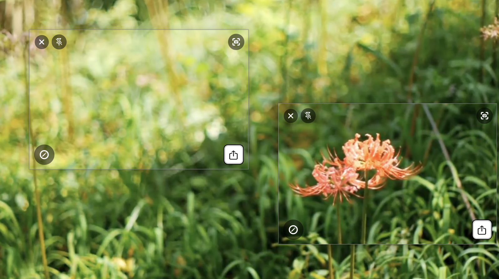
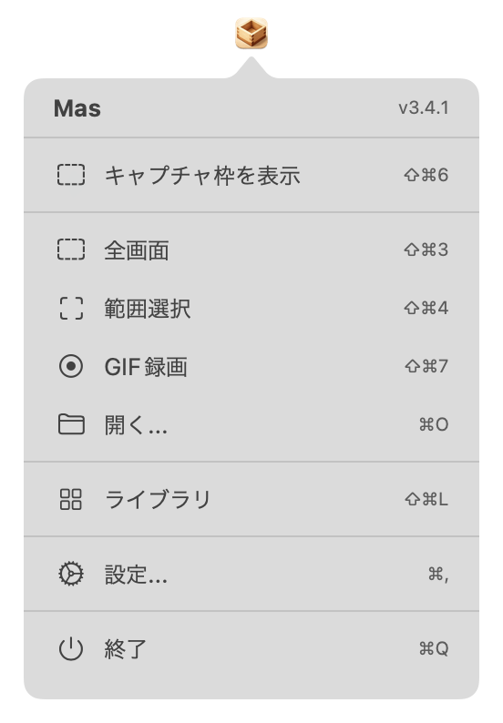
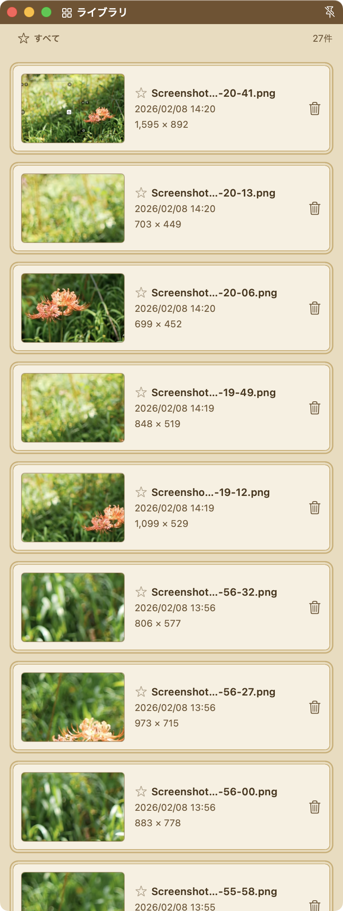
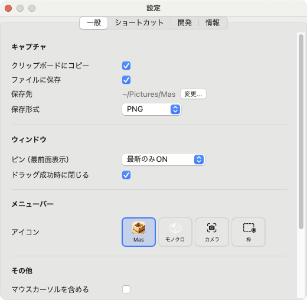

# Mas ユーザーガイド

まるでマスですくうように 簡単に正確にスクリーンショットを作成します

**Mas**（Mac Area Screenshot）は、macOS向けのスクリーンショット撮影・編集アプリです。
キャプチャからアノテーション、テキスト認識まで、スクリーンショットに必要な機能をコンパクトにまとめています。

---

## インストール

1. [Releases](https://github.com/piggest/Mas/releases) から最新の `Mas.app` をダウンロード
2. `/Applications` フォルダにドラッグ＆ドロップ
3. 初回起動時に画面収録の権限を許可してください

---

## 使い方

Masはメニューバーに常駐するアプリです。

**一番シンプルな使い方：メニューバーのMasアイコンをダブルクリック**するだけ。

1. ダブルクリックすると範囲選択モードに入ります
2. ドラッグで撮りたい範囲を選択すると、そのまま切り取られます
3. エディターウィンドウが開くので、必要に応じて編集ツールで注釈を入れられます

---

## 機能

### キャプチャ

| 方法 | 操作 | ショートカット |
|------|------|--------------|
| **範囲選択** | メニュー→「範囲選択」またはアイコンをダブルクリック | `⌘⇧4` |
| **全画面** | メニュー→「全画面」 | `⌘⇧3` |
| **キャプチャ枠** | メニュー→「キャプチャ枠を表示」（前回の範囲を枠で表示→調整→キャプチャ） | `⌘⇧6` |
| **画像を開く** | メニュー→「開く...」で既存の画像ファイルを編集 | `⌘O` |

キャプチャ後は自動的にエディターウィンドウが開きます。

### 編集ツール

エディターのフローティングツールバーから各種ツールを使えます。

| ツール | | 説明 |
|--------|:------:|------|
| 移動 |  | アノテーションをクリックして選択、ドラッグで移動 |
| ペン |  | 自由に線を描画 |
| マーカー |  | 半透明のハイライトを描画 |
| 矢印 |  | 矢印を描画 |
| 四角 |  | 四角形を描画 |
| 丸 |  | 楕円を描画 |
| 文字 |  | テキストを追加 |
| ぼかし |  | モザイク効果を適用。個人情報のマスキングに |

- **色の変更** — パレットから6色を選択
- **太さの変更** — スライダーで調整（1〜30pt）
- **縁取り** — トグルで切り替え。どんな背景でも見やすくなります
- **元に戻す / やり直し** — Undo/Redo ボタン
- **削除** — 選択中に `Delete` キーまたは削除ボタン
- **ドラッグ&ドロップ** — 画像を他のアプリにそのままドロップできます
- **ピン固定** — ウィンドウを最前面に固定

各ツールの詳細は [アノテーション詳細ガイド](annotations.md) を参照してください。

###  トリミング

ツールバーから「トリミング」を選択し、ドラッグで切り出し範囲を決定。確定ボタンで画像を切り出します。

###  テキスト選択（OCR）

スクリーンショット内のテキストを認識し、文字単位で選択・コピーできます。

1. ツールバーから「テキスト選択」（虫眼鏡アイコン）を選択
2. テキスト領域が自動でハイライトされます
3. ドラッグで**文字単位**で選択
4. `⌘C` でクリップボードにコピー

対応言語：日本語 / 英語

### ライブラリ

キャプチャ履歴を管理するウィンドウです。メニューから「ライブラリ」を選択して開きます。

- サムネイル付きでキャプチャ履歴を一覧表示
- クリックでエディターウィンドウを開閉
- 星アイコンでお気に入り登録・フィルタリング
- 不要な履歴を削除

### 設定

メニューの「設定...」（`⌘,`）から設定ウィンドウを開けます。

| 設定項目 | 説明 |
|---------|------|
| クリップボードにコピー | キャプチャ後に自動コピー |
| ファイルに保存 | キャプチャ後に自動保存 |
| 保存先フォルダ | 保存先ディレクトリの指定 |
| 保存形式 | PNG / JPEG |
| JPEG品質 | 10〜100%で調整 |
| ピン機能 | 常にON / 最新のみON / デフォルトOFF |
| ドラッグ時に閉じる | ドラッグ成功時にウィンドウを自動で閉じる |
| マウスカーソルを含める | キャプチャにカーソルを含める |
| キャプチャ音 | キャプチャ時にサウンドを再生 |
| 開発者モード | 有効にすると「開発」タブが表示される |

### キーボードショートカット

| ショートカット | 機能 |
|--------------|------|
| `⌘⇧3` | 全画面キャプチャ |
| `⌘⇧4` | 範囲選択キャプチャ |
| `⌘⇧6` | キャプチャ枠を表示 |
| `⌘O` | 画像ファイルを開く |
| `Delete` / `Backspace` | 選択中のアノテーションを削除 |
| `⌘C` | 選択テキストをコピー（OCRモード時） |

---

**関連ドキュメント:**
- [アノテーション詳細ガイド](annotations.md) — 各描画ツールの詳細な使い方
- [CLIリファレンス](cli.md) — コマンドラインツールの使い方
